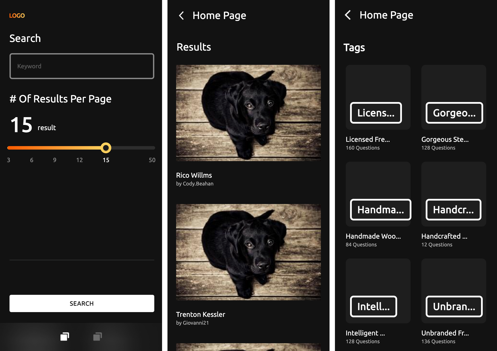
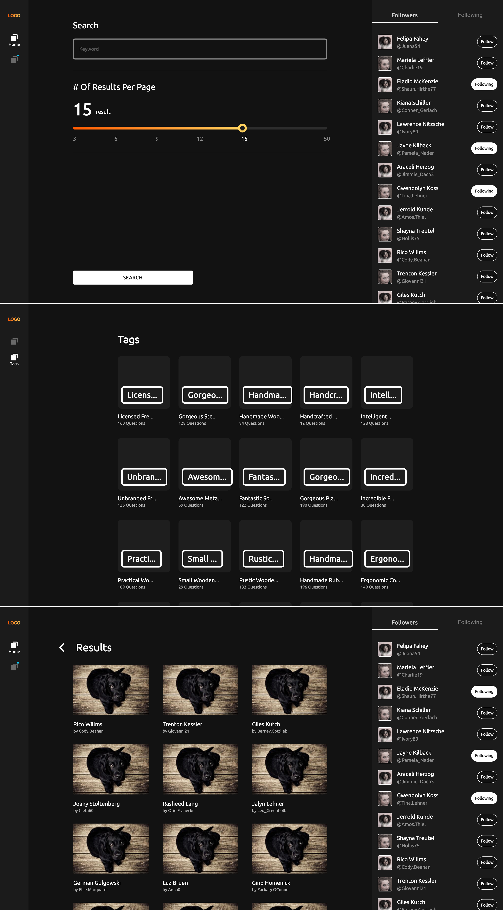

# Meta X

## Getting Started
### 1. Clone this repo
```
$ git clone https://github.com/hidayatNgganteng/metaX.git MetaX
```
### 2. Install & Setup
```
$ cd MetaX

$ yarn install
```
### 3. Run Project
```
$ yarn run start
```
## Features
#### 1. Home Screen
#### 2. Tags Screen
#### 3. Result Search Screen

## Screenshoot

#### > Mobile



#### > Desktop


